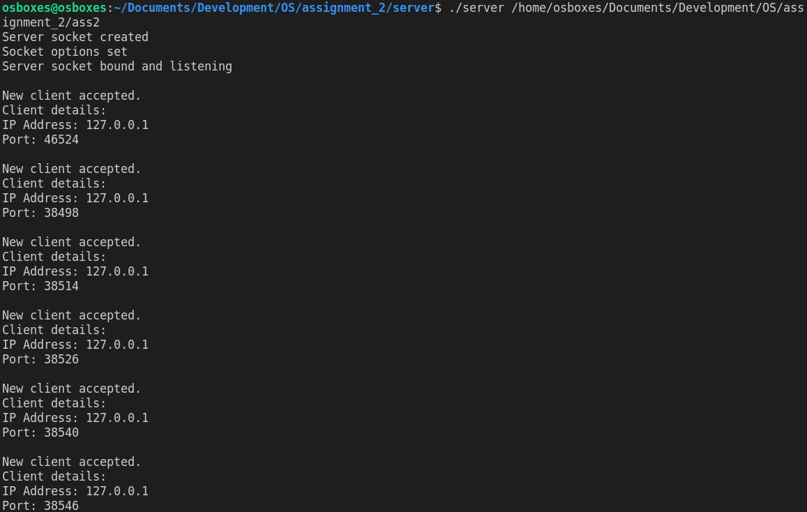
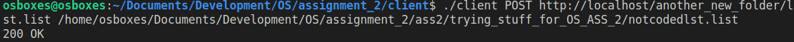
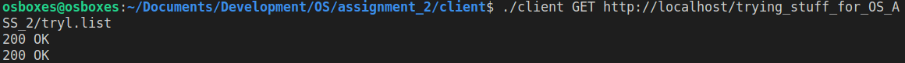

# OS-assignment-2

## Instructions for Using the Server and Client Programs

### Prerequisites

- Ensure that each file to be downloaded has a file extension (e.g., `.txt`, `.list`, etc.).

### Server Setup

- To activate the server program, provide the full path where the server will run. For example:

  `./server /path/to/server/directory`

### Client Usage

- The client program accepts the following arguments:
- `<method>`: The HTTP method to use (`POST` or `GET`). Note that the method is case-sensitive.
- `<REMOTEPATH>`: The path relative to the server's directory. This should start with the server's address (must start with `http` or `https`), followed by the DNS of the server, and then the rest of the path. For example, `https://example.com/path/relative/to/server`.
- `<PATHTOCONTENTS>`: (Only required for `POST` method) The full path to the file containing the contents to be posted.

- To download a file from the server (GET request), run the client with the following command:

  `./client GET https://example.com/path/relative/to/server`

  The file will be saved in the directory where the client is being run from, with the same name as it had on the server.

- To upload a file to the server (POST request), run the client with the following command:

  `./client POST https://example.com/path/relative/to/server /full/path/to/local/file`

  If a file with the same name already exists on the server, the request will result in a 500 Internal Server Error. The client should receive a response from the server (`200 OK`, `404 FILE NOT FOUND`, or `500 INTERNAL ERROR`).

### Additional Notes

- The line ending used in the communication between the client and server is `CRLF` (`\r\n`).

### Run Sample:
- running the server (as written in server setup above)
  
- running POST in the client (as written in client usage above)
  
- running GET in the client (as written in client usage above)
  

